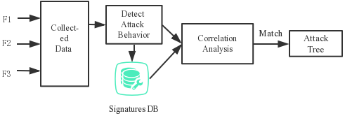

# [2018-ICCSP]The APT Detection Method based on Attack Tree for SDN
## 摘要
- 分析APT在SDN中的应用过程
- 建立了基于攻击树的APT攻击模型
- 对检测到的攻击进行相关性分析
- 得到攻击路径的多种检测方法
- 攻击路径与攻击模型匹配，判断SDN中是否存在APT

## 1. 简介
- APT攻击
  - 定义：使用多种攻击载体(物理、网络、欺诈等)为特定攻击目的(盗窃、阻塞关键任务和破坏关键设施)创造机会的攻击者
  - 简而言之，它是一种利用先进的攻击手段对特定目标进行连续攻击的网络攻击形式
- 描述APT攻击的模型
  - 入侵杀死链(IKC, Intrusion Kill Chain)
    - 将攻击过程分解为：
      - 信息收集(Information gathering)，武器化(Weaponization)，传播(Delivery)，开发(Exploitation)，安装(Installation)，命令与控制(Command and Control)，行动(Actions)
  - 树(tree)
    - 构建层级APT攻击模型
  - 金字塔(pyramid)
    - 在树的基础上，使其更加立体、层次化
  > 树与金字塔是对IKC的改进，效果更优于IKC
- APT检测方法
  - 传统网络：关联分析
    - 异常安全事件：对网络设备、安全设备、操作系统日志关联分析
    - 攻击步骤：攻击路径是否匹配攻击模型
  - SDN与传统网络存在差异性
    - 长时延，多阶段
    - 构建基于攻击树的APT攻击模型
    - 多种检测方法，获取APT攻击行为，关联SDN网络对象；通过计算攻击行为之间的相关性来获得攻击路径；攻击路径与APT攻击模型匹配，判断SDN中是否存在APT攻击
## 2. SDN中的APT攻击模型
- SDN网络中，APT的性质决定了攻击者会利用SDN漏洞，达到穿透层级攻击的目的
- 攻击树可以直观地显示APT的攻击阶段，还可以预测攻击趋势
### APT攻击阶段
- SDN中的APT攻击阶段被划分为4个：
  - 信息收集阶段(Information investigation stage)：通过社交网络、博客、社会工程学等手段收集信息
  - 扫描阶段(Scan stage)：找到目标缺陷与漏洞
  - 入侵阶段(Intrusion stage)：利用缺陷或漏洞入侵系统
  - 收益阶段(Revenue stage)：攻击者以入侵阶段为跳板攻击控制器，使控制器所覆盖的所有网络瘫痪，或者频繁访问包含重要敏感信息的节点，达到窃取敏感信息的目的
### APT攻击树模型
- 为了实现阶段性攻击，APT攻击者会采取多种复杂多样的攻击行为
- 结合APT的攻击特性，即下一阶段只与前一阶段相关，我们建立了APT的攻击树
- 
  - 信息收集(Information investigation)
  - 端口扫描(Port scan)
  - 数据流披露(Flow disclosure)
  - 交换机DDoS攻击(Switch DDoS attack)：消耗交换机资源
  - 流表篡改(Flow table tamper)
  - 控制器DDoS攻击(Controller DDoS attack)
    - Attacker sets the actions field to CONTROLLER in the flow table entry through attacking the switch, or sends a command to the switch to modify the actions field as CONTROLLER through attacking the controller.
    - Attacker forges a large number of data packets that are not present in the switch flow table, triggering the switch to submit these messages to the controller for processing
  - 信息窃取(Information theft)：APT的主要目的是窃取敏感信息，而不是破坏关键设备。因此，有必要对敏感节点的异常文件传输行为进行检测
## 3. APT检测原理
- APT攻击者会在不同的攻击阶段留下痕迹。因此我们收集了三种不同的数据资源，并使用各种检测方法来检测攻击行为，然后计算出攻击行为之间的相关性
- 
  - 数据收集(Collected Data)：
    - 全局流量(global flow set {F1}): 由控制器周期性发送OFP_flow_stats_request消息获得
    - 流表(flow table {F2}): 通过Floodlight的REST API获得
    - OF协议消息(OpenFlow protocol message {F3}): 通过监控南向接口协议获得
  - 检测攻击行为(Detect Attack Behavior)：通过多种检测方法识别与目标相关的攻击行为
  - 关联分析(Correlation Analysis)：通过计算攻击行为之间的关联度得到攻击路径，并与APT攻击树匹配，判断SDN中是否存在APT
### 3.1 检测攻击行为
- 单个攻击行为(a single attack behavior)
  - 定义：$<Id, Sip, Dip, Sport, Dport, AttackTime, AttackType>$
    - AttackType: Port scan, Flow disclosure, Switch DDoS attack, Flow table tamper, Controller DDoS attack, Information theft
  > 信息获取行为没有明显特征，无法目前无法发现
#### 3.1.1 端口扫描 PortScan
- 特征：源主机发起的所有流中的活动端口数量都将增加，并且未建立连接的比例急剧上升
- 公式：
  - Number of active ports: $a=count({obj.dst_port!=ref.dst_port AND obj.dst_addr=ref.network_addr})$
  - Proportion of unestablished connection: $u=count(obj.dst_addr=ref.dst_addr AND ((obj.pkg_count<3 AND obj.protocol=TCP) or (obj.pkg_count<2 AND obj.protocol=UDP)))/count(obj.dst_addr=ref.network_addr)$
  > obj是全网流量集合{f}中得任一条流，ref是全网流量集合中的任一参照流
  > PortScan评判标准 $\frac{xa}{A}+\frac{(1-x)u}{U}>1$
