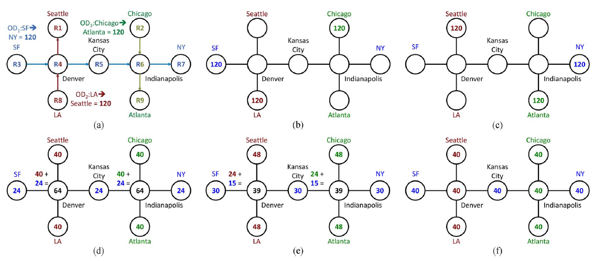
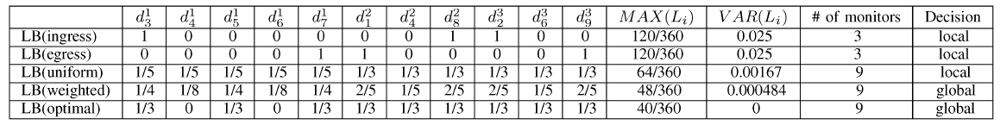

# LEISURE Load-Balanced Network-wide Traffic Measurement and Monitor Placement[2015 LEISURE]
## LEISURE FRAMEWORK

## 1. INTRODUCTION
> Contribution
>   - 提出LEISURE，公式化全网流量测量负载均衡优化问题，启发式解决方案
>     - 有限的测量点资源，有限的测量点数量，多路由路径
>   - 将LEISURE公式化为混合整数二次规划(MIQP)问题，并通过解耦两个决策变量，将其转化为标准混合整数线性规划问题
>   - 基于Abilence,GEANT网络拓扑于流量，评估算法效果
>     - 单点最大网络负载，所有测量点的负载方差(测量任务均匀分布假设下)
## 2. MOTIVATING EXAMPLE
> 利用Example说明网络负载均衡问题
> 
- 样例假设：
  - 3 OD-pairs(each with 120 units of traffic):
    - SF->NY | LA->Seattle | Chicago->Atlanta
- 解决方法：
  1. 在入/出口路由器测量(图中b,c方法)：数量少，但负载高，worst-case(peak 120 units)
  2. 将负载均分到沿路的测量点(图d方法)：数量多，负载有多又少(出现在多个路径上的负载高)
  3. 引入负载均衡，按比例计算(图e方法)：进一步减小负载
  4. 进一步优化，全局负载均衡(图f方法)：数量与负载均有减小。哪些节点参与哪些任务，每个节点该负责任务的比例
## 3. LEISURE FRAMEWORK
> 问题公式化与解决方案
- 前置条件
  - ISP通常根据 **源/目的对(OD-pairs)** 定义全网测量任务
- LEISURE
  - 测量任务定义，需要考虑流量需求、路由信息
    - 网络拓扑，流量需求，路由矩阵，测量消耗
  - 中心化的架构
  - 假设：
    - 每个路由器均具备测量功能
    - 每个OD-pair遵循最短路径算法(OSPF)
    - 每个测量点仅执行一种测量任务
- Basic Model
  - Network Topology: $G(V,E)$
  - Set of routers(monitors): $V$
  - Set of directed links: $E$
  - Router resource constraint(the number of flows that router $V_i$ can measure in a given measurement interval): $C_{v_{i}}(i=1...M)$
  - OD-pair: $OD_{x},x\in|V|\times|V-1|$
  - set of all OD-pairs: $\Theta=|V|\times|V-1|$
  - traffic demand(IP flows) of OD-pair $OD_x$: $\phi_x, x\in\Theta$
  - routing strategy for every OD-pair $OD_x$: $P_x, x\in\Theta$
  - coverage fraction of IP flows of $OD_x$ that is required to measure: $a_x$
  - total required measurement traffic: $\beta=\sum_{x\in\Theta}\phi_x\times a_x$
  - fraction of traffic demand of $OD_x$: $d_{i}^{x}$
  - the total traffic that router $V_i$ measures for all OD-pairs: $L_i$
- Problem Formulation
  - min-VAR
  - min-MAX
  - min-VAR-given-MAX
- Optimal/Heuristic Solutions
  - 二次规划QP: for min-VAR
  - 线性规划LP: for min-MAX
  - LP first QP follow: for min-VAR-given-MAX
  - 
## 4. MEASUREMENT WITH LIMITED MONITORS
> 加入资源限制条件
- 起因：实际情况下，不是每个路由器均支持/部署测量算法
- Measurement with fixed monitor deployment problem
- Measurement with flexible monitor deployment problem
  - 混合整数二次规划问题(MIQP) -> MILP
## 5. PERFORMANCE EVALUATION
> 仿真设置及效果评估
## 6. CONCLUSION
> 总结
