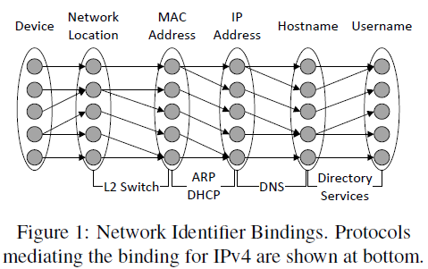

# [2018-USENIX]Identifier Binding Attacks and Defenses in Software-Defined Networks-20190821
## Abstract
- New Attack: **Persona Hijacking** 角色劫持
  - 破坏了网络堆栈所有层的绑定，并欺骗网络基础设施，使其相信攻击者是受害者标识符的合法所有者
- Defense: SECUREBINDER 安全绑定器
  - 利用SDN数据和控制平面分离、全局网络视图和网络编程控制，以IEEE 802.1x作为信任的根，从而防止在网络的所有层进行标识符绑定攻击
- Evaluate:
  - Testbed and use Model Checking
> 问题
> - 什么是角色劫持（成因、攻击方式）
>    - 更改绑定符关联的对象
> - 角色劫持攻击危害有多大
## 1.Introduction
- Identifier: to specify entities at network stack layers
  - What: like IP Address, MAC Address, domain name, physical switch port..
  - Use: establish traffic flow, deliver packets, ACL, firewall
- Identifier binding:关联标识符于网络设备
  - Example
    - DHCP服务器为主机分配IP地址时将主机**MAC地址**与**IP地址**绑定
    - ARP请求收到回复时将请求中的**IP地址**与回复中的**MAC地址**绑定
- Attack Based Identifier binding:
  - Example: DNS spoofing, ARP poisoning, DHCP forgery, host location hijacking
  - Facilitation:
    - 依赖于不安全的协议，这些协议在没有任何身份验证机制的情况下对请求和响应使用广播等技术
    - 允许绑定更改，而不考虑依赖于它们的服务对整个网络的影响
    - 允许跨不同层的独立绑定，而不需要检查一致性
    - 允许对原本设计为惟一标识符进行高级更改
- SDN环境下
  - 控制与数据平面分离，导致**转发路径决策**与**转发执行**分离
> 问题
> - SDN网络环境与传统网络环境下Identifier Binding Attack的区别
>   - 作用范围更广
>      - 不仅在自己的广播域，甚至整个SDN所控制的网络范围
>      - 不仅影响Identifier集合，甚至接管整个主机(**角色劫持**)，且具备持续性
>   - 攻击发生更频繁
- 防御方法：SECUREBINDER
  - 扩展了802.1x协议，实现对机器的身份认证
  - 额外的模块，认证MAC地址标示符
  - 所有广播流量均发送给控制器，交换机丢掉所有广播流量
- 防御代价：
  - a small overhead: latency (initial authentication step)
## 2.Identifier Binding
- 
> 文档结构
> 1. main identifiers used at different network layers
>    - Network protocols rely on identifier binding in order to operate correctly and efficiently.
> 2. identifier binding attacks in traditional networks
>    - Identifier Binding Attack
> 3. what makes these attacks more dangerous in SDN networks
- Identifier Binding Attack:
  - Definition:
    - 创建或替换了一个Binding
    - 利用Identifier关联了未知的设备导Binding
  - Facilitation:
    - 不安全的协议依赖:其中许多绑定是基于查询整个广播域的广播请求构造的，而其他绑定则是基于可欺骗的标识符隐式地形成的。因此，攻击者可以简单地通过发送欺骗包或侦听广播查询和响应来影响这些绑定。
    - 将Binding的创建与修改视作同种操作:攻击者可轻松修改已有的Binding
    - Binding改变具有局部、独立性
    - 标识符Identifier的易变性(如Mac地址):攻击者很容易模拟网络中的设备
  - varity of attacks:
    - ARP spoofing, DNS spoofing, Rogue DHCP Servers
  - Effection:
    - Scope, Consistency, Security
      - Distributed Control State(分布式控制状态):L-2 Switch Attack仅影响L2 Domain，而不影响L3 Domain
      - Intelligent Routers(智能路由): Dynamic ARP Inspection, DHCP Snooping system
      - Rapid Rule Consistency(快速规则一致): Forwarding behavior VS NIB update,引起路由黑洞或重定向
- SDN VS Traditional network
  - Unified Control Plane
    - Proxy ARP:一张master ARP表，维护整个网络的ARP信息
    - Broadcast Domain VS Entire Network
  - Bare-metal Switches
    - OpenFlow Switch内部除了控制器插入的规则外，没有包处理逻辑
    - Not provide yet VS Dynamic ARP Inspection, DHCP Snooping
  - Delayed Rule Consistency
    - NIB更新时，旧的流规则未能及时删除
## 3.Persona Hijacking
### 3.1 Attacker Model
- 场景假设：
  - An enterprise IPv4 Ethernet netowrk
    - using the Openflow SDN architecture
    - a standard OpenFlow controller
    - End-hosts use ARP to look up the MAC Address associated with an IP
    - use DHCP to obtain IP Addresses from a single DHCP server
    - an internal DNS server for managing intranet hostnames
    - a directory services package(such as Microsoft Active Directory)
- 攻击者状态
  - 拿下了一台或若干台终端主机
  - 未攻陷核心关键服务器
### 3.2 Persona hijacking Attacks
